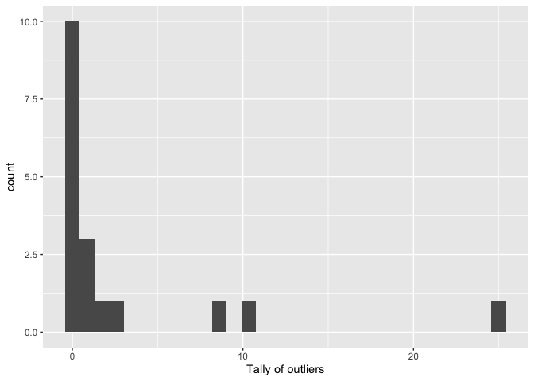
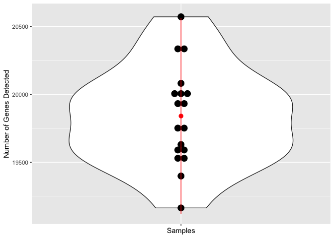
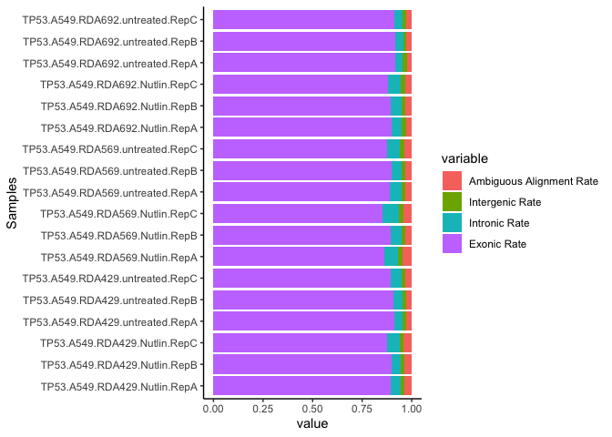
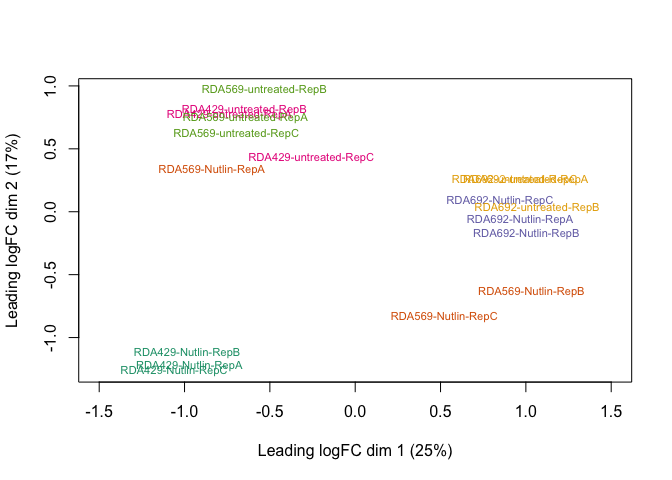
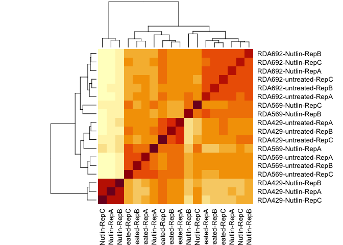
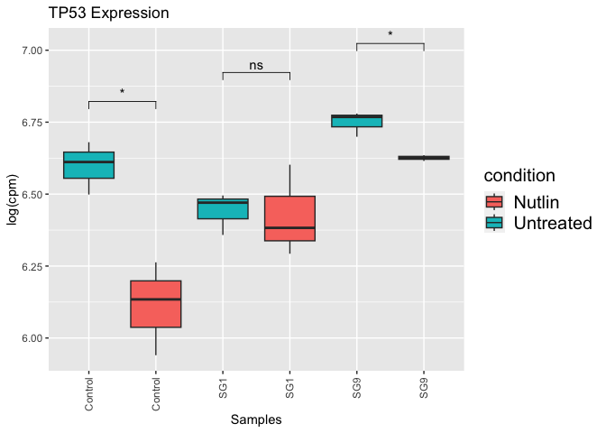

Quality Control
================
Dany Gould
2023-04-21

### RNASeQC Metrics

The Terra RNASeq pipeline uses
[RNASeQC](https://academic.oup.com/bioinformatics/article/28/11/1530/267467)
to collect sequencing and alignment quality metrics. The goal of this
analysis is to detect low quality samples.

#### 1. Import packages

``` r
library(data.table)
library(ggplot2)
library(reshape) # for melt function
library(ggpubr) # for stat compare function
```

#### 2. Import QC files

``` r
qc_file_dir <- "/Users/fu/Library/CloudStorage/GoogleDrive-fu@broadinstitute.org/Shared drives/GPP RNA Seq/2023/TP53/Terra/RNASeQC_Results/"
qc_files <- list.files(path=qc_file_dir, full.names=TRUE)
# read each file using the first column as the header, then transpose
qc_df_list <- lapply(qc_files, function(x) {
  t(read.csv(x, row.names=1, sep = '\t'))
})
# Merge all the dataframes together
# Every row is a sample, every column is a metric
qc_df <- as.data.frame(do.call(rbind, qc_df_list))
```

#### 3. Find QC outliers

Calculate the mean and standard deviation for all the metrics to see if
any sample consistently falls outside of 2SDs of each metric.

``` r
# Remove columns where all the values are the same
qc_df.unique <- qc_df[vapply(qc_df, function(x) length(unique(x)) > 1, logical(1L))]
# Create an empty matrix with the same dimensions as the metric matrix
qc_tally <- data.frame(matrix(NA, nrow = nrow(qc_df.unique), ncol = ncol(qc_df.unique)))
rownames(qc_tally) <- rownames(qc_df.unique)
colnames(qc_tally) <- colnames(qc_df.unique)
for(i in 1:ncol(qc_df.unique)) { 
  # Find mean and SD for every column
  sd.qc <- sd(qc_df.unique[,i])
  mean.qc <- mean(qc_df.unique[,i])
  
  # For each row, find if sample exceed 2sd above or below the mean
  qc_col <- qc_df.unique[, i]
  qc_tally[,i] <- (qc_col > (mean.qc + 2 * sd.qc) | qc_col < (mean.qc - 2 * sd.qc))
}
```

Plot the tally in a histogram

``` r
qc.outlier_sums <- data.frame(count=rowSums(qc_tally))
qc.outlier_histo <- ggplot(qc.outlier_sums, aes(x=count)) + 
  geom_histogram() +
  xlab("Tally of outliers")
qc.outlier_histo
```

<!-- -->

Tip: You can save the plots by using the `ggsave()` function

##### 3.1 Further QC Metric Analysis

Depending on how the histogram looks, you can take a deeper dive into
any specific metrics / samples to determine whether any samples should
be removed. Metrics like mapping rates and gene counts are good starting
points.

``` r
# Violin plot of number of genes 
df.genes_detected <- qc_df["Genes Detected"]
df.genes_detected$Samples <- rownames(qc_df)
# Convert dataframe from wide to long format
df.mapped_rates.long <- melt(setDT(df.genes_detected), id.vars = "Samples", measure.vars = "Genes Detected")
numGenes.vplot <- ggplot(df.mapped_rates.long, aes(x=variable, y=value)) + geom_violin() +
  geom_dotplot(binaxis='y', stackdir='center', dotsize=1) + 
  stat_summary(fun.data=mean_sdl, fun.args = list(mult = 2), geom="pointrange", color="red") +
  labs(x = "Samples", y = "Number of Genes Detected") + 
  theme(axis.text.x = element_blank())
numGenes.vplot
```

<!-- -->

``` r
# Stacked bar graph of rate metrics
mappedRateCols <- c("Ambiguous Alignment Rate","Intergenic Rate","Intronic Rate","Exonic Rate")
df.mapped_rates <- qc_df[,mappedRateCols]
df.mapped_rates$Samples <- rownames(df.mapped_rates)
# Convert dataframe from wide to long format
df.mapped_rates.long <- melt(setDT(df.mapped_rates), id.vars = "Samples", measure.vars = mappedRateCols)
alignmentRate.stacked <- ggplot(df.mapped_rates.long,aes(fill=variable, x=value, y=Samples )) + 
  geom_bar(position="stack", stat="identity")+theme_classic()
alignmentRate.stacked
```

<!-- -->

In this example, we chose not to remove any samples in this step because
the range of all the metrices were so tight. One sample appeared to be
an outlier in the histogram but upon closer inspection it did not
actually deviate greatly.

### Read Count Metrics

A multidimensional-scaling, or similar, plot should be constructed from
normalized read counts to show similarities between samples. There are
many libraries that can do this, the example here uses the Limma package
and their
[guide](https://www.bioconductor.org/packages/devel/workflows/vignettes/RNAseq123/inst/doc/limmaWorkflow.html#unsupervised-clustering-of-samples)
provides an in-depth explanation.

#### 1. Import packages

``` r
library(RColorBrewer)
library(edgeR)
library(limma)
```

#### 2. Import read files

``` r
reads_file_dir <- "/Users/fu/Library/CloudStorage/GoogleDrive-fu@broadinstitute.org/Shared drives/GPP RNA Seq/2023/TP53/Terra/RSEM_Results/All-reads/"

# Create a dataframe of reads from each file
read_files <- list.files(path=reads_file_dir, full.names=TRUE)
reads_list <- lapply(read_files, function(x) {
  r <- fread(x, select = c("gene_id", "expected_count"))
  file_name <- unlist(strsplit(x, "\\."))[2]
  # Change the expected_count column to the sample name
  setnames(r, c("gene_id", sub(".*TP53-A549-", "", file_name)))
})

# Merge all the reads into one dataframe
reads_df <- Reduce(function(x, y) merge(x, y, by = "gene_id", all=TRUE), reads_list)
reads_df<- as.data.frame(reads_df)
# Gene IDs are in the first column, make them rownames and then drop the column
rownames(reads_df) <- reads_df[,1]
reads_df[,1] <- NULL
```

#### 3. Pre-process the reads

``` r
# Make sure the samples in the annotation file are in the same order as the columns names of the dataframe!
annot <- read.csv("/Users/fu/Library/CloudStorage/GoogleDrive-fu@broadinstitute.org/Shared drives/GPP Cloud /R&D/People/Dany/RNAseq Analysis/TP53 Base Editing/TP53-BE-tiling-annotation.csv")
reads.dge <- DGEList(counts=reads_df, samples = annot)

# Remove lowly expressed genes
reads.dge$samples$group <- as.factor(c(annot$Sample))
# You could also do this manually, like removing any row with less than 10 reads
keep.exprs.reads <- filterByExpr(reads.dge, group = reads.dge$samples$group)
reads.dge <- reads.dge[keep.exprs.reads,, keep.lib.sizes=FALSE]

# Normalize by TMM
reads.dge <- calcNormFactors(reads.dge, method = "TMM")
reads.dge.lcpm <- cpm(reads.dge, log=TRUE) #log2 
```

Tip: You can save data objects by using the `saveRDS()` function.

#### 4. Multi-Dimensional Scaling

``` r
# Set levels to colors
sample.groups <- reads.dge$samples$group
levels(sample.groups) <-  brewer.pal(nlevels(sample.groups), "Dark2")
sample.groups <- as.character(sample.groups)
plotMDS(reads.dge.lcpm, col=sample.groups, cex=0.7, xlim=c(-1.5, 1.5))
```

<!-- -->

In our data, all the replicates cluster well except for 569-Nutlin-RepA,
which seems closer in expression to the untreated group.

#### 5. Pearson Correlation

A Pearson correlation also shows that the 569-Nutlin-RepA sample is more
similar to the control. We will need to consider whether or not to
remove this sample for downstream analysis.

``` r
cor_all <- cor(reads.dge.lcpm)
heatmap(cor_all)
```

<!-- -->

#### 6. Gene(s) of Interest

If your experiment targets specific gene(s), or you hypothesize that the
experiment could affect certain genes, a preliminary box and whisker
plot could be helpful to determine the quality of the targeting.

``` r
tp53.id <- "ENSG00000141510"

# we need grep because our read files contain a version number after the geneID
# e.g. ENSG00000141510.17 instead of just ENSG00000141510
reads.tp53 <- reads.dge.lcpm[grepl(tp53.id, rownames(reads.dge.lcpm)),]
reads.tp53.long <- data.frame("reads" = reads.tp53)
reads.tp53.long$transcript_id <- rownames(reads.tp53.long)
reads.tp53.long$group <- reads.dge$samples$group
reads.tp53.long$condition <- annot$Condition
reads.tp53.long <- melt(setDT(reads.tp53.long), 
                        id.vars = c("transcript_id", "group", "condition"), 
                        variable.name = "reads")

ggplot(reads.tp53.long, aes(x=group, y=value, palette = "BuGn",fill=condition)) + 
  geom_boxplot() + 
  ylab("log(cpm)") + xlab ("Samples") + labs(title = "TP53 Expression") + 
  theme(legend.title = element_text(size = 15), 
          legend.text = element_text(size = 15)) + 
  scale_x_discrete(guide = guide_axis(angle = 90),
                   labels= c("Control", "Control", "SG1", "SG1","SG9","SG9"), 
                   limits=c("untreated_ctrl","treated_ctrl",
                            "untreated_ex1", "treated_ex1",
                            "untreated_ex9", "treated_ex9")) + 
  stat_compare_means(label = "p.signif",method = "t.test", 
                     comparisons = list(c("treated_ctrl", "untreated_ctrl"),
                                        c("treated_ex1", "untreated_ex1"),
                                        c("treated_ex9", "untreated_ex9")))
```

<!-- -->

Tip: use `ggarrange(... common.legend = TRUE, legend="bottom")` if you
have more than one graph and would like to combine the legends.
