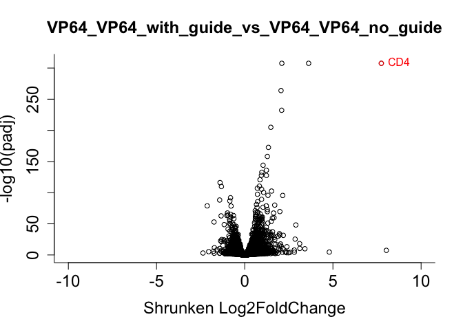

DESeq2 Protocol
================
Fengyi Zheng
3/23/2023

## **Necessary prior steps**

1.  Follow [DESeq2’s bioconductor
    instruction](http://www.bioconductor.org/packages/release/bioc/html/DESeq2.html)
    to download DESeq2

2.  Follow [CRAN
    instruction](https://www.dataquest.io/blog/install-package-r/) to
    download other r packages

## **Helpful resource**

[DESeq2
workflow](http://bioconductor.org/packages/devel/bioc/vignettes/DESeq2/inst/doc/DESeq2.html)

## **DESeq2**

### 1. Import packages

``` r
library(data.table)
library(RColorBrewer)
library(dplyr)
library(tibble)
library(stringr)
library(readxl)
library(DESeq2)
library(ggplot2)
```

### 2. Import readcount

There are two ways to import data into DESeq2.

1.  One is import all the experimental samples

2.  The other way is to subset the data to just the samples of interest.

Which method you choose dependents on the specifics of the experiment.
[See the disscussion on Bioconductor by the creater of
DESeq2](https://support.bioconductor.org/p/p132527/). For this example,
I am using two RNA-seq samples from Cas12a CRISPRa:
Meljuso_RDA816_RDA810 (VP64_VP64_with_guide) and Meljuso_RDA816_RDA986
(VP64_VP64_no_guide). Each sample has three replicates.

#### 2.1 Import all readcounts in one dataframe

Raw Count Matrix is a .csv that contains raw read counts from RSEM where
each column is a sample and each row is a gene.

``` r
base_path <- '/Users/fzheng/Google Drive/Shared drives/GPP Cloud /R&D/People/Fengyi/Cas12a/RNA_seq/terra/outputs/'
rsem <-'/call-rsem/'
rna_agg <-'/RNA_aggregate/call-rsem_aggregate_results/'
all_samples <- c('Meljuso_RDA763_RDA988_RepA',  'Meljuso_RDA816_RDA811_RepC', 
             'Meljuso_RDA763_RDA988_RepB',  'Meljuso_RDA816_RDA986_RepA',
             'Meljuso_RDA763_RDA988_RepC',  'Meljuso_RDA816_RDA986_RepB',
             'Meljuso_RDA816_RDA810_RepA',  'Meljuso_RDA816_RDA986_RepC',
             'Meljuso_RDA816_RDA810_RepB',  'Meljuso_RDA816_RDA987_RepA',
             'Meljuso_RDA816_RDA810_RepC',  'Meljuso_RDA816_RDA987_RepB',
             'Meljuso_RDA816_RDA811_RepA',  'Meljuso_RDA816_RDA987_RepC',
             'Meljuso_RDA816_RDA811_RepB')

# We usually use the gene results instead of isoform -- .rsem.genes.results.gz
# The aggregated isoform is equal to gene
read_files <- paste0(base_path, all_samples, rsem, all_samples, '.rsem.genes.results.gz')

reads_list <- lapply(read_files, function(x) {
  r <- fread(x, select = c("gene_id", "expected_count"))
  file_name <- unlist(strsplit(x, "Meljuso_"))[2]
  # Change the expected_count column to the sample name
  setnames(r, c("gene_id", sub("/call-rsem/", "", file_name)))
})
reads_df <- Reduce(function(x, y) merge(x, y, by = "gene_id", all=TRUE), reads_list)
reads_df<- as.data.frame(reads_df)

head(reads_df)
```

    ##              gene_id RDA763_RDA988_RepA RDA816_RDA811_RepC RDA763_RDA988_RepB
    ## 1 ENSG00000000003.14             525.00             695.00             554.00
    ## 2  ENSG00000000005.5               0.00               0.00               0.00
    ## 3 ENSG00000000419.12             964.00            1009.00            1103.00
    ## 4 ENSG00000000457.13             131.67             107.25             115.06
    ## 5 ENSG00000000460.16             460.33             333.75             477.94
    ## 6 ENSG00000000938.12              43.00              13.00              54.00
    ##   RDA816_RDA986_RepA RDA763_RDA988_RepC RDA816_RDA986_RepB RDA816_RDA810_RepA
    ## 1             622.00             664.00             572.00             528.00
    ## 2               0.00               0.00               0.00               0.00
    ## 3             966.00            1320.00             867.00             723.00
    ## 4             113.84             130.07              98.81             114.99
    ## 5             416.16             567.93             425.19             211.01
    ## 6              14.00              43.00              16.00              21.00
    ##   RDA816_RDA986_RepC RDA816_RDA810_RepB RDA816_RDA987_RepA RDA816_RDA810_RepC
    ## 1             583.00             613.00              733.0             550.00
    ## 2               0.00               0.00                0.0               0.00
    ## 3             917.00             858.00              959.0             721.00
    ## 4             127.04             154.72              155.2             123.27
    ## 5             386.96             338.28              370.8             229.73
    ## 6              24.00              16.00               23.0              25.00
    ##   RDA816_RDA987_RepB RDA816_RDA811_RepA RDA816_RDA987_RepC RDA816_RDA811_RepB
    ## 1             641.00             606.00             774.00             536.00
    ## 2               0.00               0.00               0.00               0.00
    ## 3             898.00             832.00            1086.00             836.00
    ## 4             122.01             140.02             156.78             130.21
    ## 5             443.99             271.98             480.22             297.79
    ## 6              26.00              30.00              41.00              31.00

#### 2.2. You can also subset the data

``` r
sampleid <- read_excel('/Users/fzheng/Library/CloudStorage/GoogleDrive-fzheng@broadinstitute.org/Shared drives/GPP Cloud /R&D/People/Fengyi/Cas12a/Data/rna_seq/sampleID.xlsx')
sampleid$sample_id <- sub("Meljuso_", "", sampleid$sample_id)

selected_col <- sampleid[ sampleid$Name %in%  c('VP64_VP64_with_guide', 'VP64_VP64_no_guide'),]$sample_id
selected_reads_df <- reads_df[, c("gene_id", selected_col)]
head(selected_reads_df)
```

    ##              gene_id RDA816_RDA810_RepA RDA816_RDA810_RepB RDA816_RDA810_RepC
    ## 1 ENSG00000000003.14             528.00             613.00             550.00
    ## 2  ENSG00000000005.5               0.00               0.00               0.00
    ## 3 ENSG00000000419.12             723.00             858.00             721.00
    ## 4 ENSG00000000457.13             114.99             154.72             123.27
    ## 5 ENSG00000000460.16             211.01             338.28             229.73
    ## 6 ENSG00000000938.12              21.00              16.00              25.00
    ##   RDA816_RDA986_RepA RDA816_RDA986_RepB RDA816_RDA986_RepC
    ## 1             622.00             572.00             583.00
    ## 2               0.00               0.00               0.00
    ## 3             966.00             867.00             917.00
    ## 4             113.84              98.81             127.04
    ## 5             416.16             425.19             386.96
    ## 6              14.00              16.00              24.00

### 3. Prepare the file to run deseq2 and select sample comparison

To successfully run DESeq2, make sure to have the row name as the gene
name and numeric raw count.

``` r
result <- data.frame(selected_reads_df, row.names = selected_reads_df$gene_id)
result <- result[,-c(1)]
result <- mutate_all(result, function(x) as.numeric(as.character(x)))
head(result)
```

    ##                    RDA816_RDA810_RepA RDA816_RDA810_RepB RDA816_RDA810_RepC
    ## ENSG00000000003.14             528.00             613.00             550.00
    ## ENSG00000000005.5                0.00               0.00               0.00
    ## ENSG00000000419.12             723.00             858.00             721.00
    ## ENSG00000000457.13             114.99             154.72             123.27
    ## ENSG00000000460.16             211.01             338.28             229.73
    ## ENSG00000000938.12              21.00              16.00              25.00
    ##                    RDA816_RDA986_RepA RDA816_RDA986_RepB RDA816_RDA986_RepC
    ## ENSG00000000003.14             622.00             572.00             583.00
    ## ENSG00000000005.5                0.00               0.00               0.00
    ## ENSG00000000419.12             966.00             867.00             917.00
    ## ENSG00000000457.13             113.84              98.81             127.04
    ## ENSG00000000460.16             416.16             425.19             386.96
    ## ENSG00000000938.12              14.00              16.00              24.00

### 4. Create design formula based on the samples

DESeq2 uses design formula to indicate to which samples are control and
treatment. For the purpose of this example, to properly set up design
formula, there should be two columns.

-   SampleID: samples name

-   Condition: indicate whether it is control or treatment aka the
    condition of the samples.

Note it is absolutely critical that the columns of the count matrix and
the rows of the design formula (SampleID) are in the same order.

``` r
design.formula <- as.data.frame(colnames(result))
colnames(design.formula) <- 'sample_id'
design.formula <- merge(design.formula, sampleid[,c('sample_id', 'Name')], by = 'sample_id',all = FALSE)
colnames(design.formula) <- c('SampleID', 'Condition')

design.formula
```

    ##             SampleID            Condition
    ## 1 RDA816_RDA810_RepA VP64_VP64_with_guide
    ## 2 RDA816_RDA810_RepB VP64_VP64_with_guide
    ## 3 RDA816_RDA810_RepC VP64_VP64_with_guide
    ## 4 RDA816_RDA986_RepA   VP64_VP64_no_guide
    ## 5 RDA816_RDA986_RepB   VP64_VP64_no_guide
    ## 6 RDA816_RDA986_RepC   VP64_VP64_no_guide

### 5. Set up DEseq2 Data Object

DESeq2 uses *DESeqDataSetFromMatrix* to store the read counts,
relationship between samples, and statistical estimates.

-   countData: raw count from RSEM with all the conditions

-   colData: Design Formula from step 4

-   design: column name for condition in Design Formula

``` r
dds <- DESeqDataSetFromMatrix(countData=round(result), 
                              colData=design.formula, 
                              design=~Condition)
```

### 6. Set reference

By default, R will choose a reference level for factors based on
alphabetical order. So we need to indicate the reference level through
the function *relevel*. After using the *relevel*, the first element in
*Levels:* will be the new reference and the order of the data table will
not change.

Since design formula is already stored in **dds**, we can just use
**dds** to move forward. To set reference, we subset the *Condition*
from **dds** and set *ref* to the control indicated in the design
formula.

``` r
factor(dds$Condition)
```

    ## [1] VP64_VP64_with_guide VP64_VP64_with_guide VP64_VP64_with_guide
    ## [4] VP64_VP64_no_guide   VP64_VP64_no_guide   VP64_VP64_no_guide  
    ## Levels: VP64_VP64_no_guide VP64_VP64_with_guide

``` r
dds$Condition <- relevel(factor(dds$Condition), "VP64_VP64_no_guide")
factor(dds$Condition)
```

    ## [1] VP64_VP64_with_guide VP64_VP64_with_guide VP64_VP64_with_guide
    ## [4] VP64_VP64_no_guide   VP64_VP64_no_guide   VP64_VP64_no_guide  
    ## Levels: VP64_VP64_no_guide VP64_VP64_with_guide

### 7. Pre-filtering

Remove any genes when sum of all counts across replicates and samples
are less than 10.

``` r
dds <- dds[ rowSums(counts(dds)) > 10, ]
```

### 8. DESeq2 – Shunken LFC

1.  DESeq: is used to establish statistical calculation from the
    information stored in *DESeqDataSetFromMatrix*

2.  results: is used to extract a results table with log2 fold changes,
    p values and adjusted p values.

3.  lfcShrink: is used to perform shrunken LFC and coef is the name or
    number of the coefficient (LFC) to shrink.We use apeglm to shrink
    LFC.

4.  resultsNames: is used to select the coefficient to perform shrunken
    LFC.

We uses shrunken LFC to measure differences in activity, as this metric
allows for the shrinkage of LFC estimates towards zero for genes with
low normalized read counts.

``` r
dds <- DESeq(dds)
######################################################
### run those two lines if you want to see the default estimates for DESeq2
#res_dds <- results(dds) # results is an optional command to show you the estimates
#head(res_dds)
####################################
```

``` r
resultsNames(dds)
```

    ## [1] "Intercept"                                           
    ## [2] "Condition_VP64_VP64_with_guide_vs_VP64_VP64_no_guide"

``` r
shrink_dds <- lfcShrink(dds, coef='Condition_VP64_VP64_with_guide_vs_VP64_VP64_no_guide')
```

    ## using 'apeglm' for LFC shrinkage. If used in published research, please cite:
    ##     Zhu, A., Ibrahim, J.G., Love, M.I. (2018) Heavy-tailed prior distributions for
    ##     sequence count data: removing the noise and preserving large differences.
    ##     Bioinformatics. https://doi.org/10.1093/bioinformatics/bty895

``` r
shrink_dds <- as.data.frame(na.omit(shrink_dds))
head(shrink_dds)
```

    ##                     baseMean log2FoldChange      lfcSE       pvalue
    ## ENSG00000000003.14 575.50741     0.10641499 0.08395641 1.722666e-01
    ## ENSG00000000419.12 834.13319    -0.05994613 0.07292168 3.848148e-01
    ## ENSG00000000457.13 122.10117     0.28617204 0.18251809 3.540125e-02
    ## ENSG00000000460.16 326.53253    -0.43377120 0.12339086 8.663723e-05
    ## ENSG00000000938.12  19.63681     0.08190587 0.22208946 3.872861e-01
    ## ENSG00000000971.15 121.78985     1.75490356 0.20142569 1.782543e-19
    ##                            padj
    ## ENSG00000000003.14 3.065964e-01
    ## ENSG00000000419.12 5.455110e-01
    ## ENSG00000000457.13 8.751326e-02
    ## ENSG00000000460.16 4.533698e-04
    ## ENSG00000000938.12 5.481271e-01
    ## ENSG00000000971.15 5.579925e-18

### 9. Obtain normalized readcount

To extract normalized read count from DESeq2, we can the function
`counts` and set normalized to True.

``` r
norm_count<- counts(dds, normalized=TRUE)
norm_count <- as.data.frame(norm_count)

head(norm_count)
```

    ##                    RDA816_RDA810_RepA RDA816_RDA810_RepB RDA816_RDA810_RepC
    ## ENSG00000000003.14          609.12899           570.4195          619.91020
    ## ENSG00000000419.12          834.09139           798.4012          812.64592
    ## ENSG00000000457.13          132.67014           144.2333          138.63446
    ## ENSG00000000460.16          243.42086           314.5217          259.23517
    ## ENSG00000000938.12           24.22672            14.8886           28.17774
    ## ENSG00000000971.15          192.66011           189.8297          184.84595
    ##                    RDA816_RDA986_RepA RDA816_RDA986_RepB RDA816_RDA986_RepC
    ## ENSG00000000003.14          569.70921          524.04947          559.82707
    ## ENSG00000000419.12          884.78955          794.31974          880.55133
    ## ENSG00000000457.13          104.41616           90.70087          121.95204
    ## ENSG00000000460.16          381.02738          389.37242          371.61763
    ## ENSG00000000938.12           12.82304           14.65873           23.04605
    ## ENSG00000000971.15           46.71249           49.47320           67.21766

## **Generate graphs**

### 1 Volcano plot

Now we can generate a volcano plot from the Shrunken LFC and adjusted
p-values (DESeq2 defaults to Benjamini-Hochberg to adjust p-values)

``` r
volcano_plot <-function(deseq_input, highlight_gene = "ENSG00000010610.9", gene_name = 'CD4', plot_title = 'VP64_VP64_with_guide_vs_VP64_VP64_no_guide'){
  deseq_input <-deseq_input[complete.cases(deseq_input), ]
  deseq_input <- as.data.frame(deseq_input)
  deseq_input <- tibble::rownames_to_column(deseq_input, "ensgene")
  deseq_input[deseq_input[,'padj'] == 0,]$padj <- .Machine$double.xmin #.Machine$double.xmin gives the value of the smallest positive number whose representation meets the requirements of IEEE 754 technical standard for floating point computation.

  par(mfrow=c(1,1), cex.axis = 1.5,
  cex.lab  = 1.5, cex.main = 1.5)

  # Make a basic volcano plot
  with(deseq_input, plot(log2FoldChange, -log10(padj), pch = 1, cex=0.9, col = 'black', main=plot_title, bty = "l", xlim = c(-10,10), ylim = c(0, 310), xlab = "Shrunken Log2FoldChange")) 

  # highlighting the CD4 dot
  with(subset(deseq_input[deseq_input[,'ensgene'] == highlight_gene,]), points(log2FoldChange, -log10(padj),
      pch = 1, cex=0.9, col="red")) 

  # add CD4 text by the dot
  text(x = deseq_input[deseq_input[,'ensgene'] == highlight_gene,]$log2FoldChange , 
     y=-log10(deseq_input[deseq_input[,'ensgene'] == highlight_gene,]$padj),
     labels=gene_name, pos=4, col="red", font = 20) 

}

volcano_plot(as.data.frame(shrink_dds))
```

<!-- -->

### 2 Baseline vs LFC plot

Now we can generate a Baseline vs LFC plot from the Shrunken LFC and
baseline(control) normalized mean readcounts

``` r
bl_color_scale = c("red","#373737")
x_label = "log2(baseline expression)"
y_label = "Shrunken log2FoldChange"

# calcuate the average normalized readcount for the baseline(control)
norm_count$ctl_mean <- rowMeans(norm_count[,design.formula[design.formula$Condition == 'VP64_VP64_no_guide',]$SampleID])

# merging normalized readcount and statistical estimates from DESeq2 
together_comp <- merge(shrink_dds, norm_count, by = 0)

colnames(together_comp)[1] <- 'gene_id'

# create a column to indicate CD4
together_comp$sig <- 'False'
together_comp[together_comp[,'gene_id']  == 'ENSG00000010610.9',]$sig = 'CD4'


# graph
ggplot(together_comp %>% arrange(desc(sig)), aes(x=log2(ctl_mean), y=log2FoldChange, color=sig)) + 
  geom_point( size = 4) + 
  theme_classic() + 
  xlab(x_label) + 
  ylab(y_label) + 
  theme(text = element_text(size = 15)) +
  geom_text(aes(label=ifelse(gene_id == 'ENSG00000010610.9',as.character('CD4'),'')),hjust=0,vjust=0, size = 6)+
  scale_colour_manual(values= bl_color_scale) + ylim(-7, 10)  + guides(color = FALSE) +
  ggtitle("VP64_VP64_with_guide_vs_VP64_VP64_no_guide") +
  ggeasy::easy_center_title()
```

<!-- -->
