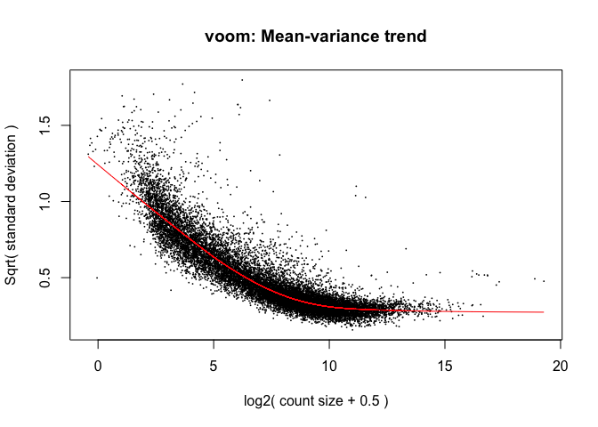
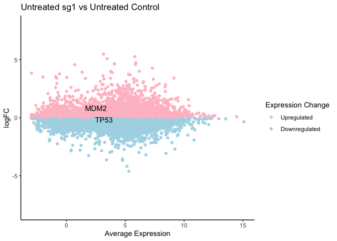

Differential Gene Expression Analysis
================
Dany Gould
2023-06-14

There are numerous tools to test for differentially expressed genes
(DEGs), all different in their approach and results. Even within the
same library there are multiple ways to carry out the analysis. This
folder contains example code for two of the most popular libraries
currently -
[Limma](https://www.ncbi.nlm.nih.gov/pmc/articles/PMC4402510/) and
[DESeq2](https://genomebiology.biomedcentral.com/articles/10.1186/s13059-014-0550-8).
We will default to using Limma but it may be necessary to adopt DESeq2
(or other alternatives) depending on experimental specifics.

### Limma

------------------------------------------------------------------------

#### 1. Import packages

``` r
library(limma)
library(edgeR)
library(ggpubr)
library(ggplot2)
library(data.table)
library(biomaRt) # for importing ensembl data
```

#### 2. Import Read files

Read files are the `.rsem.genes.results` or `.rsem.genes.results.gz`
files downloaded from Terra

``` r
reads_file_dir <- "/Users/fu/Library/CloudStorage/GoogleDrive-fu@broadinstitute.org/Shared drives/GPP RNA Seq/2023/TP53/Terra/RSEM_Results/All-reads/"
read_files <- list.files(path=reads_file_dir, full.names=TRUE)
# Create a dataframe of reads from each file
reads_list <- lapply(read_files, function(x) {
r <- fread(x, select = c("gene_id", "expected_count"))
file_name <- unlist(strsplit(x, "\\."))[2]
# Change the expected_count column to the sample name
setnames(r, c("gene_id", sub(".*TP53-A549-", "", file_name)))
})

# Merge all the reads into one dataframe
reads_df <- Reduce(function(x, y) merge(x, y, by = "gene_id", all=TRUE), reads_list)
reads_df<- as.data.frame(reads_df)
# Gene IDs are in the first column, make them rownames and then drop the column
rownames(reads_df) <- reads_df[,1]
reads_df[,1] <- NULL
```

#### 3. Pre-process the reads

``` r
# Make sure the samples in the annotation file are in the same order as the columns names of the dataframe!
annot <- read.csv("/Users/fu/Library/CloudStorage/GoogleDrive-fu@broadinstitute.org/Shared drives/GPP Cloud /R&D/People/Dany/RNAseq Analysis/TP53 Base Editing/TP53-BE-tiling-annotation.csv")

# Remove 569-Nutlin-RepA from analysis (see 02_Quality_Control for reasoning behind this)
annot.minus.outlier <- annot[annot$Outlier=="FALSE",]
reads_df.minus.outlier <- subset(reads_df, select=-c(`RDA569-Nutlin-RepA`))

# Make DGE object
reads.dge.minus.outlier <- edgeR::DGEList(counts=reads_df.minus.outlier, samples = annot.minus.outlier)
reads.dge.minus.outlier$samples$group <- as.factor(c(annot.minus.outlier$Sample))

# Remove lowly expressed genes
# There are many valid ways to do so - for example, remove any row where the sum of the row < 10
# Here we use the filterByExpr from the edgeR package described by Chen et al (2016)
keep.exprs.reads <- edgeR::filterByExpr(reads.dge.minus.outlier, group = reads.dge.minus.outlier$samples$group)
reads.dge.minus.outlier <- reads.dge.minus.outlier[keep.exprs.reads,, keep.lib.sizes=FALSE]

# Calculate normalization factors using EdgeR's trimmed mean of M values
reads.dge.minus.outlier <- calcNormFactors(reads.dge.minus.outlier, method = "TMM")
```

#### 4. Differentially Expressed Genes (DEG) Analysis

##### 4.1 Create Design Matrix

Refer to this
[guide](https://bioconductor.org/packages/release/workflows/vignettes/RNAseq123/inst/doc/designmatrices.html)
to understand how to create an appropriate matrix for your experiment.
Note: In an orthogonal data set such as this, the means model and
means-reference model will give the same results at the end. The
following is an example of the Means Model, refer to
`means-reference-model.R` to see how this experiment was analyzed *with*
an intercept.

``` r
group <- reads.dge.minus.outlier$samples$group
# ~0 = Means Model = NO intercept
design.no_intercept <- model.matrix(~0+group)
colnames(design.no_intercept) <- gsub("group", "", colnames(design.no_intercept))
```

##### 4.2 Make Contrasts

Choose comparisons of interest using the `makeContrasts` function, only
one is included here for simplicity.

``` r
contrast.no_intercept <- makeContrasts(
"Untreated sg1 vs Untreated Control" = untreated_sg1 - untreated_ctrl,
levels = colnames(design.no_intercept))
contrast.no_intercept
```

    ##                 Contrasts
    ## Levels           Untreated sg1 vs Untreated Control
    ##   nutlin_ctrl                                     0
    ##   nutlin_sg1                                      0
    ##   nutlin_sg9                                      0
    ##   untreated_ctrl                                 -1
    ##   untreated_sg1                                   1
    ##   untreated_sg9                                   0

##### 4.3 Linear Modeling

Refer to the Limma user guide and workflow documentation linked above to
understand how Limma works and which parameters to use for your
analysis.

``` r
# voom converts raw counts to log-CPM values by automatically extracting library sizes and normalisation factors
v.no_intercept <- voom(reads.dge.minus.outlier, design.no_intercept, plot=TRUE)
```

<!-- -->

``` r
fit.no_intercept <- lmFit(v.no_intercept, design.no_intercept)
fit.no_intercept <- contrasts.fit(fit.no_intercept, contrasts=contrast.no_intercept)
fit.no_intercept <- eBayes(fit.no_intercept)
summary(decideTests(fit.no_intercept))
```

    ##        Untreated sg1 vs Untreated Control
    ## Down                                 2141
    ## NotSig                              12701
    ## Up                                   1459

##### 4.4 DEG Summary

``` r
toptable <- topTable(fit.no_intercept, coef="Untreated sg1 vs Untreated Control", number=Inf, adjust.method="BH")
head(toptable)
```

    ##                        logFC  AveExpr         t      P.Value    adj.P.Val
    ## ENSG00000115129.13  2.689957 6.937743  37.13773 1.463111e-20 2.385017e-16
    ## ENSG00000148175.12 -1.682385 6.828308 -28.23329 4.029333e-18 2.534651e-14
    ## ENSG00000151640.12  2.841557 4.567451  28.03113 4.664716e-18 2.534651e-14
    ## ENSG00000163735.6  -1.360811 8.645860 -24.46197 7.402550e-17 3.016724e-13
    ## ENSG00000099994.10 -1.989845 6.823196 -21.91837 6.755616e-16 2.202466e-12
    ## ENSG00000106541.11 -2.132185 6.657348 -21.43027 1.060860e-15 2.882179e-12
    ##                           B
    ## ENSG00000115129.13 35.72974
    ## ENSG00000148175.12 30.96211
    ## ENSG00000151640.12 29.48670
    ## ENSG00000163735.6  28.55625
    ## ENSG00000099994.10 26.31971
    ## ENSG00000106541.11 25.84391

### Visualization

------------------------------------------------------------------------

#### 1. Get log normalized count values

``` r
reads.dge.minus.outlier.lcpm <- cpm(reads.dge.minus.outlier, log=TRUE) #log2 
```

#### 2. Calculate average expression of reference

The `AveExpr` column of the TopTable is the average expression across
*all* replicates. We need to manually subset the data to get the average
expression of just the reference.

``` r
toptable$RefAvg <- rowMeans(reads.dge.minus.outlier.lcpm[, annot.minus.outlier$Sample == "untreated_ctrl"]) 
head(toptable)
```

    ##                        logFC  AveExpr         t      P.Value    adj.P.Val
    ## ENSG00000115129.13  2.689957 6.937743  37.13773 1.463111e-20 2.385017e-16
    ## ENSG00000148175.12 -1.682385 6.828308 -28.23329 4.029333e-18 2.534651e-14
    ## ENSG00000151640.12  2.841557 4.567451  28.03113 4.664716e-18 2.534651e-14
    ## ENSG00000163735.6  -1.360811 8.645860 -24.46197 7.402550e-17 3.016724e-13
    ## ENSG00000099994.10 -1.989845 6.823196 -21.91837 6.755616e-16 2.202466e-12
    ## ENSG00000106541.11 -2.132185 6.657348 -21.43027 1.060860e-15 2.882179e-12
    ##                           B    RefAvg
    ## ENSG00000115129.13 35.72974  6.667761
    ## ENSG00000148175.12 30.96211  5.687044
    ## ENSG00000151640.12 29.48670  3.036795
    ## ENSG00000163735.6  28.55625  4.853913
    ## ENSG00000099994.10 26.31971 -1.460237
    ## ENSG00000106541.11 25.84391  7.616139

#### 3. Get Gene Names from Ensembl

``` r
mart <- useDataset("hsapiens_gene_ensembl", useMart("ensembl"))
toptable$geneID <- rownames(toptable)
toptable$geneID <- lapply(toptable$geneID, function(x) unlist(strsplit(x, "\\."))[1])
toptable$geneID<-as.character(toptable$geneID)
genelist <- getBM(filters=c("ensembl_gene_id"), attributes= c("ensembl_gene_id","hgnc_symbol"), values=toptable$geneID, mart=mart)
toptable <- merge(toptable, genelist, by.x="geneID", by.y="ensembl_gene_id")
head(toptable)
```

    ##            geneID       logFC    AveExpr          t      P.Value    adj.P.Val
    ## 1 ENSG00000000003 -0.42911186  6.6467617 -5.2462886 3.414087e-05 3.872862e-04
    ## 2 ENSG00000000419 -0.21217456  5.6150822 -3.1492670 4.861859e-03 2.596761e-02
    ## 3 ENSG00000000457 -0.02880008  3.0453581 -0.1874306 8.531316e-01 9.273023e-01
    ## 4 ENSG00000000460 -0.34429116  4.5648076 -4.1977221 4.088951e-04 3.319422e-03
    ## 5 ENSG00000000938  0.67714818 -0.6349731  1.0080095 3.249842e-01 5.387997e-01
    ## 6 ENSG00000000971 -1.13856623  7.4237684 -9.7561439 3.137359e-09 1.440622e-07
    ##            B     RefAvg hgnc_symbol
    ## 1  1.8748115  4.5689625      TSPAN6
    ## 2 -2.9223737  6.5428931        DPM1
    ## 3 -6.4432140 -0.2455504       SCYL3
    ## 4 -0.3418133  3.7252928    C1orf112
    ## 5 -4.8095431  4.8549074         FGR
    ## 6 11.2534927  7.0063799         CFH

#### 4. Plot Reference Mean vs LFC

``` r
ggplot(toptable, aes(x=RefAvg, y=logFC, color=logFC < 0 )) + 
  geom_point() + 
  theme_classic() + 
  scale_y_continuous(limits = c(-8, 8)) + 
  labs(title = "Untreated sg1 vs Untreated Control", x = "Average Expression", color = "Expression Change") + 
  scale_color_manual(labels = c("Upregulated", "Downregulated"), values = c("pink", "lightblue")) + 
  geom_text(aes(label=ifelse(hgnc_symbol=="TP53", hgnc_symbol,'')), color="black") + 
  geom_text(aes(label=ifelse(hgnc_symbol=="MDM2", hgnc_symbol,'')), color="black")
```

<!-- -->

### Notes

------------------------------------------------------------------------

In this example we analyzed the data set as a whole, allowing the linear
model to “borrow” information across all the samples. Subsetting the
data *will* change the results, and while the creators of Limma
recommend analyzing the whole experiment together, this is not a hard
and fast rule. See the [discussion on
Bioconductor](https://support.bioconductor.org/p/p132527/) and the
answer from the creator of DESeq2 on this topic. See DESeq code sample
for an experiment where the data was subsetted.

The code sample here only shows the result of one comparison - Untreated
sg1 vs Untreated control - for simplicity. Code optimizations for
analyzing the whole experiment is available as a R script.
