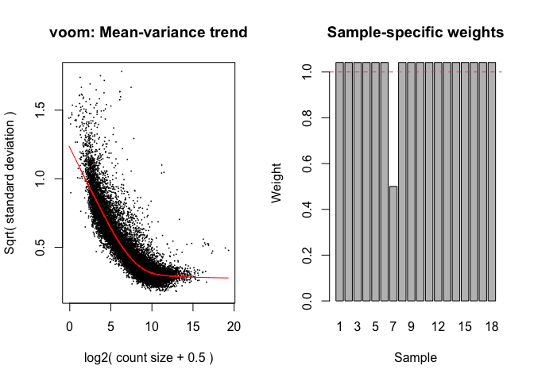
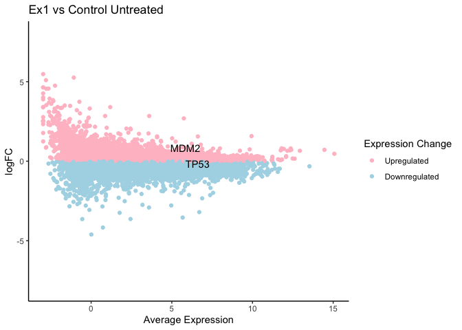

Limma Protocol
================
Dany Gould
2023-04-24

### Limma Guides

- Limma’s [User
  Guide](https://bioconductor.org/packages/release/bioc/vignettes/limma/inst/doc/usersguide.pdf)
- Limma
  [Workflow](https://www.bioconductor.org/packages/devel/workflows/vignettes/RNAseq123/inst/doc/limmaWorkflow.html)

#### 1. Import packages

``` r
library(edgeR)
library(limma)
library(data.table)
library(ggplot2)
#library(ggpubr)
library(biomaRt)
```

#### 2. Import Read files

Read files are the `.rsem.genes.results` or `.rsem.genes.results.gz`
files downloaded from Terra

``` r
reads_file_dir <- "/Users/fu/Library/CloudStorage/GoogleDrive-fu@broadinstitute.org/Shared drives/GPP RNA Seq/2023/TP53/Terra/RSEM_Results/All-reads/"
read_files <- list.files(path=reads_file_dir, full.names=TRUE)
# Create a dataframe of reads from each file
reads_list <- lapply(read_files, function(x) {
  r <- fread(x, select = c("gene_id", "expected_count"))
  file_name <- unlist(strsplit(x, "\\."))[2]
  # Change the expected_count column to the sample name
  setnames(r, c("gene_id", sub(".*TP53-A549-", "", file_name)))
})

# Merge all the reads into one dataframe
reads_df <- Reduce(function(x, y) merge(x, y, by = "gene_id", all=TRUE), reads_list)
reads_df<- as.data.frame(reads_df)
# Gene IDs are in the first column, make them rownames and then drop the column
rownames(reads_df) <- reads_df[,1]
reads_df[,1] <- NULL
```

#### 3. Pre-process the reads

``` r
# Make sure the samples in the annotation file are in the same order as the columns names of the dataframe!
annot <- read.csv("/Users/fu/Library/CloudStorage/GoogleDrive-fu@broadinstitute.org/Shared drives/GPP Cloud /R&D/People/Dany/RNAseq Analysis/TP53 Base Editing/TP53-BE-tiling-annotation.csv")
reads.dge <- DGEList(counts=reads_df, samples = annot)

# Remove lowly expressed genes
reads.dge$samples$group <- as.factor(c(annot$Sample))
# You could also do this manually, like removing any row with less than 10 reads
keep.exprs.reads <- filterByExpr(reads.dge, group = reads.dge$samples$group)
reads.dge <- reads.dge[keep.exprs.reads,, keep.lib.sizes=FALSE]

# Normalize by TMM
reads.dge <- calcNormFactors(reads.dge, method = "TMM")
reads.dge.lcpm <- cpm(reads.dge, log=TRUE) #log2 
```

#### 4. Differentially Expressed Genes (DEG) Analysis

##### 4.1 Create Design Matrix

Refer to this
[guide](https://bioconductor.org/packages/release/workflows/vignettes/RNAseq123/inst/doc/designmatrices.html)
to understand how to create an appropriate matrix for your experiment.
Note: In an orthogonal data set such as this, the means model and
means-reference model will give the same results at the end. The
following is an example of the Means Model, refer to
`means-reference-model.R` to see how this dataset was analyzed *with* an
intercept.

``` r
group <- reads.dge$samples$group
# ~0 = Means Model = NO intercept
design.no_intercept <- model.matrix(~0+group)
colnames(design.no_intercept) <- gsub("group", "", colnames(design.no_intercept))
```

##### 4.2 Make Contrasts

``` r
contrast.no_intercept <- makeContrasts(
  "Ex1 vs Control Untreated" = untreated_ex1 - untreated_ctrl, 
  "Ex9 vs Control Untreated" = untreated_ex9 - untreated_ctrl, 
  "Ex1 vs Control Nutlin" = treated_ex1 - treated_ctrl, 
  "Ex9 vs Control Nutlin" = treated_ex9 - treated_ctrl, 
  "Nutlin Control vs Untreated Control" = treated_ctrl - untreated_ctrl,
  "Nutlin Ex1 vs Untreated Ex1" = treated_ex1 - untreated_ex1,
  "Nutlin Ex9 vs Untreated Ex9" = treated_ex9 - untreated_ex9,
  levels = colnames(design.no_intercept))
contrast.no_intercept
```

    ##                 Contrasts
    ## Levels           Ex1 vs Control Untreated Ex9 vs Control Untreated
    ##   treated_ctrl                          0                        0
    ##   treated_ex1                           0                        0
    ##   treated_ex9                           0                        0
    ##   untreated_ctrl                       -1                       -1
    ##   untreated_ex1                         1                        0
    ##   untreated_ex9                         0                        1
    ##                 Contrasts
    ## Levels           Ex1 vs Control Nutlin Ex9 vs Control Nutlin
    ##   treated_ctrl                      -1                    -1
    ##   treated_ex1                        1                     0
    ##   treated_ex9                        0                     1
    ##   untreated_ctrl                     0                     0
    ##   untreated_ex1                      0                     0
    ##   untreated_ex9                      0                     0
    ##                 Contrasts
    ## Levels           Nutlin Control vs Untreated Control
    ##   treated_ctrl                                     1
    ##   treated_ex1                                      0
    ##   treated_ex9                                      0
    ##   untreated_ctrl                                  -1
    ##   untreated_ex1                                    0
    ##   untreated_ex9                                    0
    ##                 Contrasts
    ## Levels           Nutlin Ex1 vs Untreated Ex1 Nutlin Ex9 vs Untreated Ex9
    ##   treated_ctrl                             0                           0
    ##   treated_ex1                              1                           0
    ##   treated_ex9                              0                           1
    ##   untreated_ctrl                           0                           0
    ##   untreated_ex1                           -1                           0
    ##   untreated_ex9                            0                          -1

##### 4.3 Create Design Matrix for Sample Weight

Since we saw in the QC step that 569-Nutlin-RepA is a possible outlier,
we will account for this in Limma by using the `voomWithQualityWeights`
function instead of `voom`. Note: if your Mean-Variance graph does not
look like the one below, you likely did not filter the genes
sufficiently.

``` r
design.outlier <- model.matrix(~0+annot$Outlier)
v.qw <- voomWithQualityWeights(reads.dge, design.no_intercept, var.design=design.outlier, plot=TRUE)
```

<!-- -->

##### 4.4 Linear Modeling

Refer to the Limma user guide and workflow documentation linked above to
understand how Limma works and which parameters to use for your
analysis.

``` r
fit.qw <- lmFit(v.qw, design.no_intercept)
fit.qw <- contrasts.fit(fit.qw, contrasts=contrast.no_intercept)
fit.qw <- eBayes(fit.qw)
fit.qw.summary <- summary(decideTests(fit.qw))
fit.qw.summary
```

    ##        Ex1 vs Control Untreated Ex9 vs Control Untreated Ex1 vs Control Nutlin
    ## Down                       2156                     1047                  3792
    ## NotSig                    12269                    14425                  8289
    ## Up                         1504                      457                  3848
    ##        Ex9 vs Control Nutlin Nutlin Control vs Untreated Control
    ## Down                    4384                                3728
    ## NotSig                  7434                                8110
    ## Up                      4111                                4091
    ##        Nutlin Ex1 vs Untreated Ex1 Nutlin Ex9 vs Untreated Ex9
    ## Down                           303                           2
    ## NotSig                       14522                       15923
    ## Up                            1104                           4

##### 4.5 Summary of DEGs

``` r
# Fetch gene names from Ensembl
mart <- useDataset("hsapiens_gene_ensembl", useMart("ensembl"))

# Function to make a summary table including gene names
makeTopTableWithGeneNames = function(fit, colName){
  toptable <- topTable(fit,coef=colName, number=Inf,adjust.method="BH")
  toptable$geneID <- rownames(toptable)
  # Remove the version number
  toptable$geneID <- lapply(toptable$geneID, function(x) unlist(strsplit(x, "\\."))[1])
  toptable$geneID<-as.character(toptable$geneID)
  genelist <- getBM(filters=c("ensembl_gene_id"), attributes= c("ensembl_gene_id","hgnc_symbol"), values=toptable$geneID, mart=mart)
  return(merge(toptable, genelist, by.x="geneID", by.y="ensembl_gene_id"))
}

# Make a named vector of summary tables with names from summary()
toptables.qw <- list()
for(name in colnames(fit.qw.summary)){
  toptables.qw[[name]] <- makeTopTableWithGeneNames(fit.qw, colName=name)
}
head(toptables.qw[["Ex1 vs Control Untreated"]])
```

    ##            geneID       logFC    AveExpr          t      P.Value    adj.P.Val
    ## 1 ENSG00000000003 -0.42782811  6.6405693 -5.1794036 4.354450e-05 4.712095e-04
    ## 2 ENSG00000000419 -0.21079043  5.6163781 -2.9225483 8.331329e-03 3.896352e-02
    ## 3 ENSG00000000457 -0.02754806  3.0455277 -0.1841279 8.557400e-01 9.277895e-01
    ## 4 ENSG00000000460 -0.34290112  4.5619233 -4.2894045 3.473450e-04 2.820010e-03
    ## 5 ENSG00000000938  0.67608279 -0.6812113  0.9201428 3.683039e-01 5.762980e-01
    ## 6 ENSG00000000971 -1.13728274  7.3792597 -9.3074041 9.119028e-09 3.715013e-07
    ##            B hgnc_symbol
    ## 1  1.6489724      TSPAN6
    ## 2 -3.4301151        DPM1
    ## 3 -6.4509336       SCYL3
    ## 4 -0.1716545    C1orf112
    ## 5 -4.8780161         FGR
    ## 6 10.2009721         CFH

#### 5. Create Baseline Expression vs LFC Plot

The `AveExpr` column of the TopTable is the average expression across
*all* replicates. We need to manually subset the data to get the average
expression of just the reference.

``` r
refAvg.df <- data.frame(matrix(ncol=4, nrow=nrow(reads.dge.lcpm), 
                              dimnames=list(rownames(reads.dge.lcpm), 
                                            c("untreated_ctrl_mean", "treated_ctrl_mean", 
                                              "untreated_ex1_mean", "untreated_ex9_mean"))))
rownames(refAvg.df) <- lapply(rownames(refAvg.df), function(x) unlist(strsplit(x, "\\."))[1])
refAvg.df$untreated_ctrl_mean <- rowMeans(reads.dge.lcpm[, annot$Sample == "untreated_ctrl"])
refAvg.df$treated_ctrl_mean <- rowMeans(reads.dge.lcpm[, annot$Sample == "treated_ctrl"])
refAvg.df$untreated_ex1_mean <- rowMeans(reads.dge.lcpm[, annot$Sample == "untreated_ex1"])
refAvg.df$untreated_ex9_mean <- rowMeans(reads.dge.lcpm[, annot$Sample == "untreated_ex9"])
head(refAvg.df)
```

    ##                 untreated_ctrl_mean treated_ctrl_mean untreated_ex1_mean
    ## ENSG00000000003            6.657821         7.2905245           6.230163
    ## ENSG00000000419            5.677118         5.8464417           5.470767
    ## ENSG00000000457            3.027025         3.3075786           2.994775
    ## ENSG00000000460            4.844010         3.7492083           4.511207
    ## ENSG00000000938           -1.465868        -0.6429237          -1.013034
    ## ENSG00000000971            7.606191         8.5434227           6.470265
    ##                 untreated_ex9_mean
    ## ENSG00000000003          6.5027435
    ## ENSG00000000419          5.5719472
    ## ENSG00000000457          2.9640002
    ## ENSG00000000460          4.8925707
    ## ENSG00000000938          0.3457076
    ## ENSG00000000971          7.5031804

Create a helper function to plot the average log2 expression of each
gene against the LFC, and specifically highlight TP53 and MDM2 since
these are two genes of interest in this experiment.

``` r
meanDifferencePlot = function(topTable, title) {
  return(
    ggplot(topTable, aes(x=RefAvg, y=logFC, color=logFC < 0 )) + 
      geom_point() + 
      theme_classic() + 
      scale_y_continuous(limits = c(-8, 8)) + 
      labs(title = title, x = "Average Expression", color = "Expression Change") + 
      scale_color_manual(labels = c("Upregulated", "Downregulated"), values = c("pink", "lightblue")) + 
      geom_text(aes(label=ifelse(hgnc_symbol=="TP53", hgnc_symbol,'')), color="black") + 
      geom_text(aes(label=ifelse(hgnc_symbol=="MDM2", hgnc_symbol,'')), color="black") 
  )
}
```

``` r
# Define the mapping between the names of the TopTables to its reference
refMap <- c(
  "Ex1 vs Control Untreated" = "untreated_ctrl_mean",
  "Ex9 vs Control Untreated" = "untreated_ctrl_mean",
  "Ex1 vs Control Nutlin" = "treated_ctrl_mean",
  "Ex9 vs Control Nutlin" = "treated_ctrl_mean",
  "Nutlin Control vs Untreated Control" = "untreated_ctrl_mean",
  "Nutlin Ex1 vs Untreated Ex1" = "untreated_ex1_mean",
  "Nutlin Ex9 vs Untreated Ex9" = "untreated_ex9_mean"
)

plotList <- list()
# Loop through the names of the TopTables and use the mapping to add the reference average
# as a new column to the table
for(name in names(toptables.qw)){
  toptables.qw[[name]]$RefAvg <- refAvg.df[refMap[name]][toptables.qw[[name]]$geneID,]
  plotList[[name]] <- meanDifferencePlot(toptables.qw[[name]], name) 
}

#pdf(paste(analysis_dir, "Figures/DEG-MeanModel-QualityWeight.pdf", sep=""))
#ggarrange(plotlist=plotList, ncol=2, nrow=2, common.legend = TRUE, legend="bottom")
#dev.off()

# Show one plot as example, uncomment the code above to save all 7 plots to a PDF
plotList[["Ex1 vs Control Untreated"]]
```

<!-- -->
