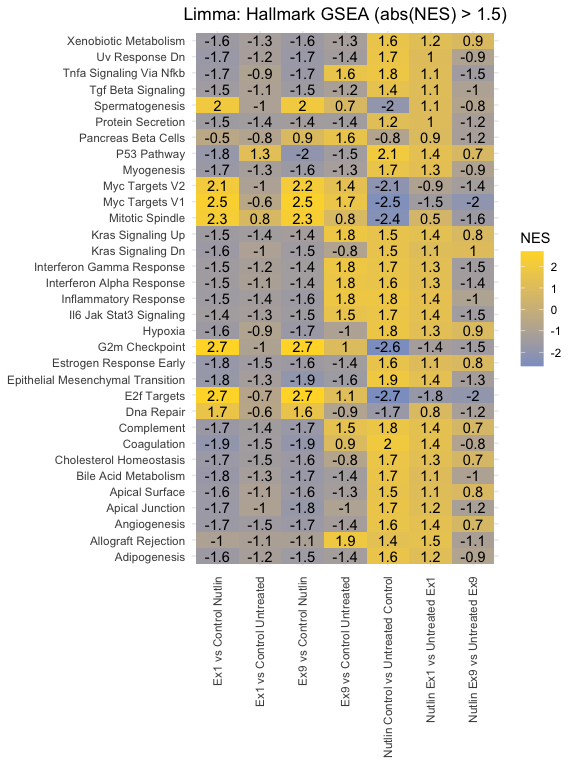

Gene Set Enrichment Analysis (GSEA)
================
Dany Gould
2023-05-05

The `fgsea` algorithm has the following requirements:  
1. Pre-defined gene set.  
2. Pre-ranked gene list.

#### 1. Import packages

``` r
library(fgsea)
library(msigdbr) # for gene sets
library(stringr) # for string replace functions
library(dplyr)
library(data.table)
library(ggplot2)
library(ggpmisc)
```

#### 2. Import gene sets

Gene sets are imported from the [Molecular Signatures
Database](https://www.gsea-msigdb.org/gsea/msigdb)

``` r
# Fetch Molecular Signature Database gene sets
hallmark = msigdbr(species = "Homo sapiens", category = 'H')
# Coerce into a format for fgsea
hallmark.ls = split(x = hallmark$ensembl_gene, f = hallmark$gs_name)
```

#### 3. Rank genes

There are many ways to rank genes which will change the interpretation
of the GSEA results. Using the output of Limma, we chose to rank the
genes by log10(fdr)\*lfc. In this case, the FDR will determine the
magnitude while the LFC determines the direction, meaning genes at the
top of the list are the most significant with a positive LFC, and genes
at the bottom of the list are the most significant with a negative LFC.
This allows us to see which gene sets are negatively or positively
enriched in the phenotype.

``` r
toptable$gsea_rankby <- -log10(toptable$adj.P.Val) * toptable$logFC
```

We previously saved the limma output tables in RDS files and will read
them in

``` r
rds_file_dir <- "/Users/fu/Library/CloudStorage/GoogleDrive-fu@broadinstitute.org/Shared drives/GPP Cloud /R&D/People/Dany/RNAseq Analysis/TP53 Base Editing/limma-toptables"
rds_file_names <- list.files(path=rds_file_dir, full.names=TRUE)
rds_list <- lapply(rds_file_names, readRDS)
names(rds_list) <- lapply(rds_file_names, function(x) {
  tools::file_path_sans_ext(basename(x))
})
```

#### 4. GSEA

Helper function for calling `fgsea`

``` r
# toptable - the output of limma, including the gsea_rankby column
# geneSet - the gene set imported from MSigDB
# newName - identifier for the sample, to replace the NES column name
# nPerm - number of gene set permutation for significance calculations
GSEA = function(toptable, geneSet, newName, nPerm=1000) {
  geneList <- toptable$gsea_rankby
  names(geneList) <- toptable$geneID
  
  # Remove duplicates - by default the first occurring duplicate will be kept
  # Manually check your dataframe before doing this to make sure that this
  # is a well-informed decision
  if(any(duplicated(names(geneList)) )  ) {
    geneList <- geneList[!duplicated(names(geneList))]
  }
  
  # Sort the list in decreasing gsea_rankby order
  if(!all( order(geneList, decreasing = TRUE) == 1:length(geneList)) ){
    geneList <- sort(geneList, decreasing = TRUE)
  }
  
  res <- fgsea::fgsea(pathways = geneSet, 
                      stats = geneList,
                      scoreType = 'std', # two-tailed test
                      nPermSimple=nPerm)
  names(res)[6] <- newName
  return(as.data.frame(res))
}
```

``` r
hallmark.limma.plot.list <- list()
for (name in names(rds_list)) {
  gsea.res <- GSEA(rds_list[[name]], hallmark.ls, name, nPerm=10000)
  hallmark.limma.plot.list[[name]] <- gsea.res[c("pathway", name)]
}
```

Helper plotting function

``` r
GSEA.HEAPMAP = function(geneset.df, title, minNES=1.5) {
  # Filter for absolute value of NES > minNES
  filtered.df <- geneset.df[apply(abs(geneset.df[,-1])> minNES,1,any),] 
  filtered.dt.melt <- melt(setDT(filtered.df), 'pathway')
  # Only capitalize the first letter
  filtered.dt.melt$pathway<-str_to_title(filtered.dt.melt$pathway) 
  # Change column name of "value" to "NES"
  names(filtered.dt.melt)[names(filtered.dt.melt) == 'value'] <- 'NES'
  
  return(ggplot(filtered.dt.melt, aes(variable, pathway)) +
           geom_tile(aes(fill = NES))+
           scale_fill_gradient(low = "#8DA0CB", high = "#FFD92F")+ 
           geom_text(aes(label = round(NES, 1))) + theme_minimal()+
           theme(axis.title.x=element_blank(),
                 axis.title.y=element_blank(),
                 axis.text.x = element_text(angle = 90, vjust = 0.5, hjust=1))+ 
           ggtitle(title) +
           ggeasy::easy_center_title())
}
```

``` r
hallmark.limma.df <- Reduce(function(x, y) merge(x, y, all=TRUE, by='pathway'), hallmark.limma.plot.list)
hallmark.limma.df$pathway <- str_replace(hallmark.limma.df$pathway, "HALLMARK_", "") # remove the HALLMARK_ prefix
hallmark.limma.df$pathway <- str_replace_all(hallmark.limma.df$pathway, "_", " ") # remove all underscores

# Show pathways where NES > 1.5 for any of the samples
GSEA.HEAPMAP(hallmark.limma.df, title="Limma: Hallmark GSEA (abs(NES) > 1.5)")
```

<!-- -->
